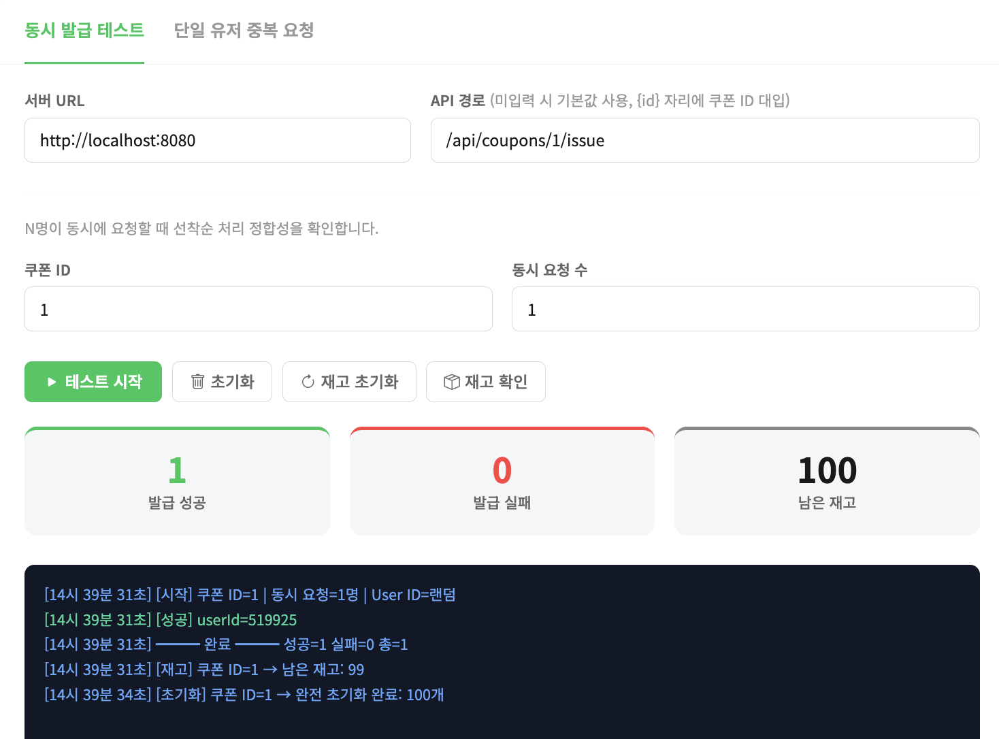
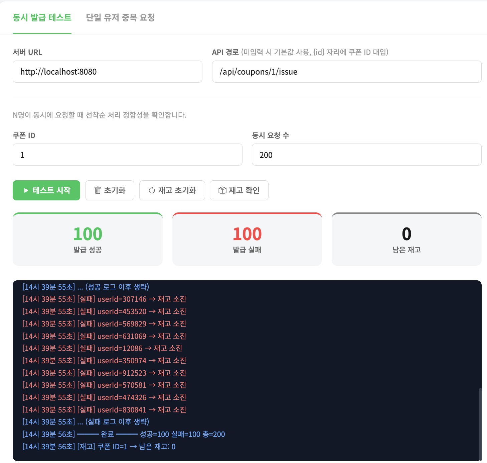
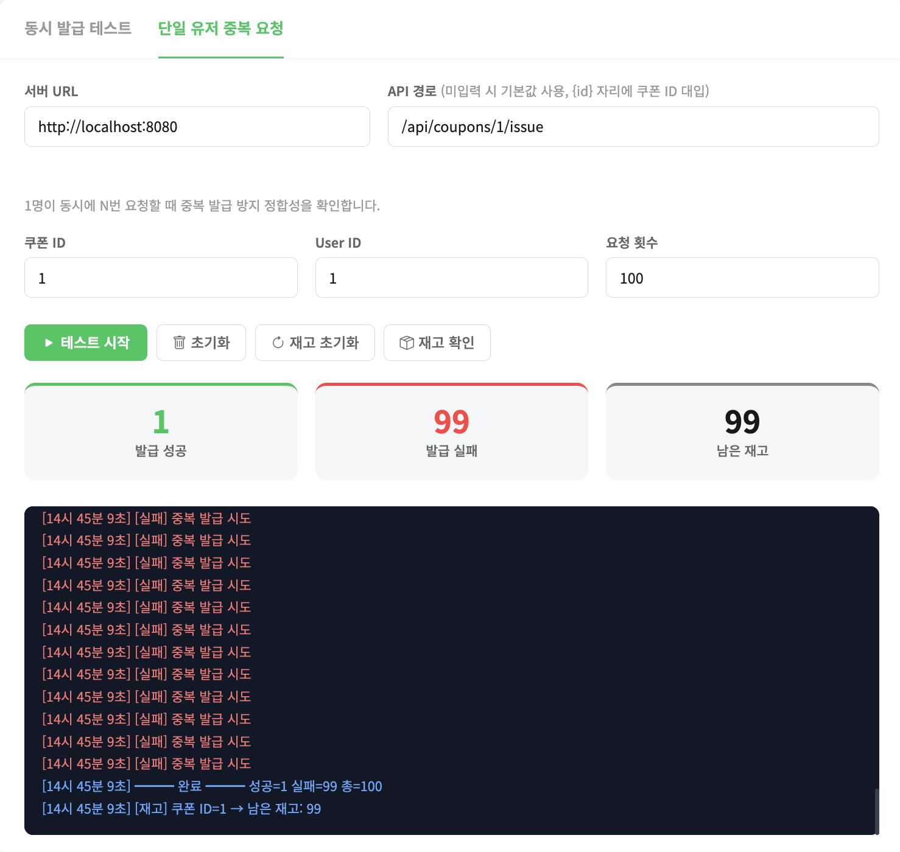
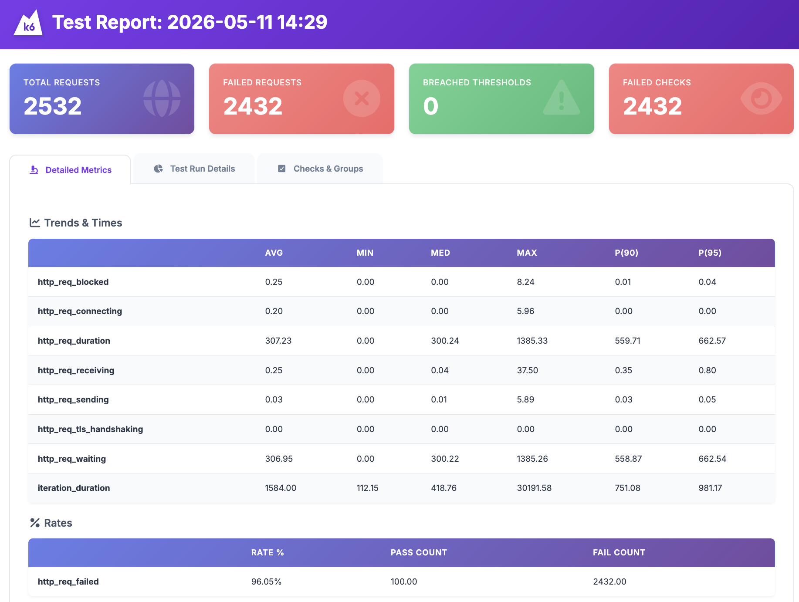
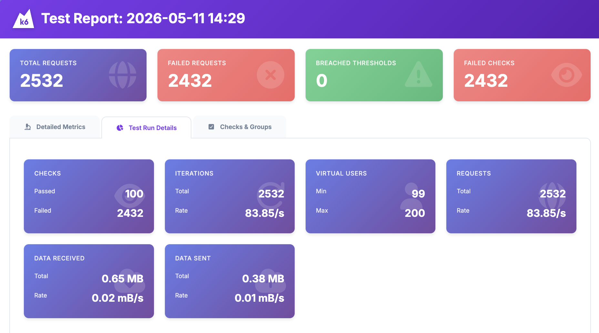
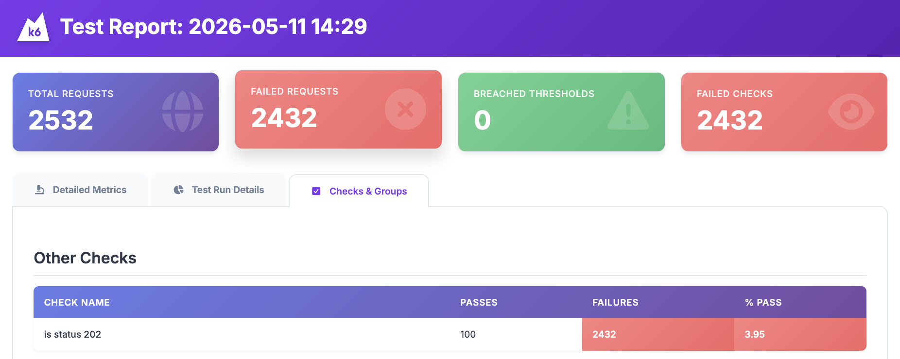

# 실시간 선착순 쿠폰 발급 시스템 구현

## 브라우저 부하 테스트 사용

### 재고 확인 및 초기화


### 동시 발급 테스트


### 단일 유저 중복 요청 테스트


----
## 실제 부하 테스트 도구 테스트

```bash
# k6 사용
k6 run --vus 200 --duration 10s script.js
```
<br>

### 결과 Screenshot (summary.html)



